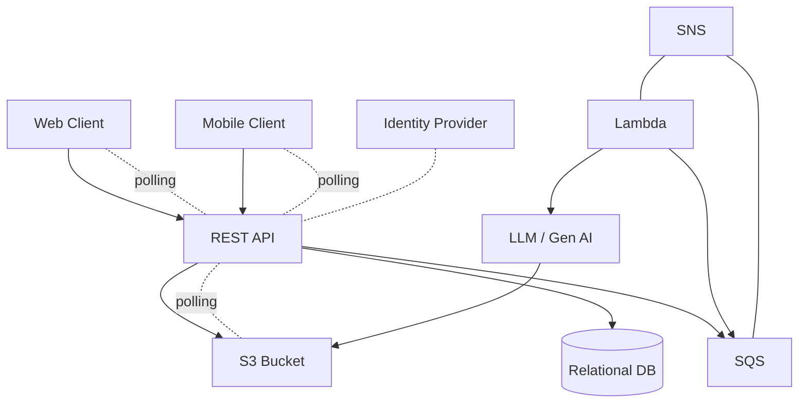
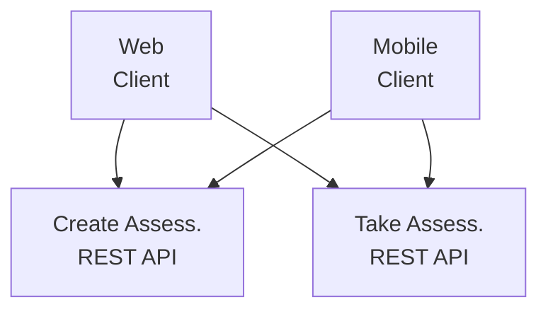

# Assessment API with Gen AI Utility

```mermaid
flowchart TD
    webClient[Web Client] --> restApi[REST API]
    webClient -.- |polling|restApi
    mobileClient[Mobile Client] --> restApi
    mobileClient  -.- |polling|restApi
    
    restApi --> db[(Relational DB)]
    restApi --> sqs[SQS]
    restApi --> s3
    restApi -.- |polling|s3
    
    lambda[Lambda] --> sqs
    lambda --> ai[LLM / Gen AI]
    ai --> s3[S3 Bucket]
    
    sns[SNS] --- sqs
    sns --- lambda

    idp[Identity Provider] -.- restApi
```
- Utilize the Asynchronous Request-Reply pattern

# Assessment API
- Scalability
- Reliability
- Don't overwhelm a vender

``` mermaid
flowchart 
    webclient["Web 
    Client"] 
    apiCreate["Create Assess. 
    REST API"]
    mobileclient["Mobile
    Client"]
    apiTake["Take Assess.
    REST API"]

    webclient & mobileclient --> apiCreate & apiTake
```